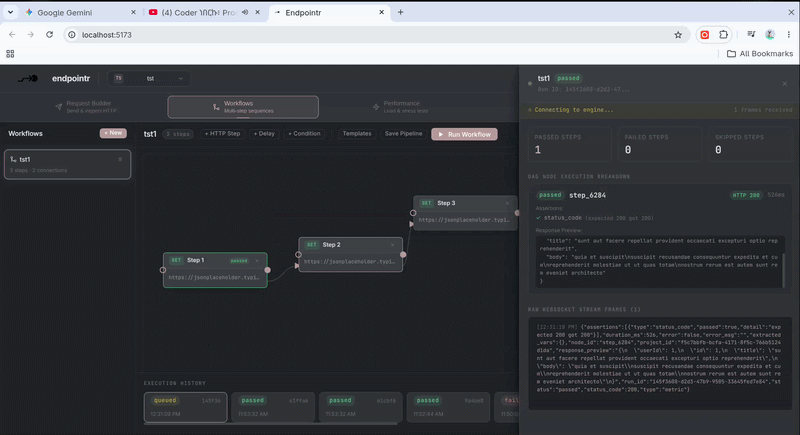

<p align="center">
  
</p>

<h1 align="center">Endpointr</h1>

<p align="center">
  <strong>API Testing, Visual DAG Workflows & Real-Time Observability Platform</strong>
</p>

<p align="center">
  <a href="#-preview">Preview</a> •
  <a href="#-features">Features</a> •
  <a href="#-quick-start-with-docker">Quick Start</a> •
  <a href="#-architecture">Architecture</a> •
  <a href="#-tech-stack">Tech Stack</a>
</p>

---

##  Preview



---

##  Features

- ** Interactive Request Builder**: Compose and execute HTTP requests with custom headers, path/query variables, raw JSON, and auth options.
- ** DAG Workflow Engine**: Build multi-step API test pipelines visually using React Flow DAGs. Automatically extract variables from responses, delay execution, evaluate conditions, and chain dependent requests.
- ** Real-Time Observability**: Stream live execution status, node metrics, latency, assertion results, and raw response previews over NATS JetStream & WebSockets.
- ** Performance & Load Testing**: Run multi-mode performance tests (load, stress, rate limit, fuzz) powered by a high-throughput Go execution engine.
- ** Health & Monitoring**: Track 30-day uptime heatmaps, probe incidents, and timeseries metrics stored in TimescaleDB.

---

## Quick Start with Docker

The easiest way to run Endpointr is using Docker Compose, which spins up the full stack (Control Plane, Execution Engine, Metrics Engine, NATS, Redis, Postgres, TimescaleDB, and Frontend).

### Prerequisites
- [Git](https://git-scm.com/)
- [Docker](https://www.docker.com/) & Docker Compose v2+

### 1. Clone the Repository
```bash
git clone https://github.com/temesgensida-code/Endpointr.git
cd Endpointr
```

### 2. Start the Stack with Docker Compose
Run the following command to build and launch all services in detached mode:
```bash
docker compose up -d --build
```

### 3. Access the Application
Once the containers are healthy, open your browser and navigate to:
- **Frontend App**: [http://localhost:5173](http://localhost:5173)
- **Django Control Plane API**: [http://localhost:8000](http://localhost:8000)

### 4. Stopping the Application
To stop all running services and containers:
```bash
docker compose down
```

---

## Architecture

Endpointr uses an event-driven microservices architecture:

```
Browser (React SPA)
    ↕ REST  (port 8000)
    ↕ WS    (port 8000, ws://.../ws/...)
Django (Daphne) ──NATS publish──▶ execution-service (Go)
                                        │  results.run.completed / results.metric
                                        ▼
                               NATS ──▶ realtime/bridge.py ──▶ Redis channel groups
                                                                  ↓
                                                          WebSocket consumers
                                                                  ↓
                                                              Browser
                               NATS ──▶ metrics-service (Go) ──▶ TimescaleDB
```

---

##  Tech Stack

| Layer | Technology | Description |
|---|---|---|
| **Frontend** | React 19 + Vite 8 | Single Page Application with React Flow DAG canvas and Vanilla CSS styling |
| **Control Plane** | Django 6 + Daphne | ASGI web server handling API orchestration, projects, collections, and workflows |
| **Execution Engine** | Go 1.25 | Concurrent worker service for executing DAG node workflows and load tests |
| **Metrics Engine** | Go 1.25 | High-throughput ingestion service writing metric event batches to TimescaleDB |
| **Message Bus** | NATS 2.10 | JetStream broker bridging control-plane requests and execution results |
| **Real-Time Layer** | Redis 7 + Channels | Pub/Sub channel layer for streaming live WebSocket events to the browser |
| **Databases** | PostgreSQL 16 & TimescaleDB | Relational metadata storage and time-series metrics hypertable |

---
